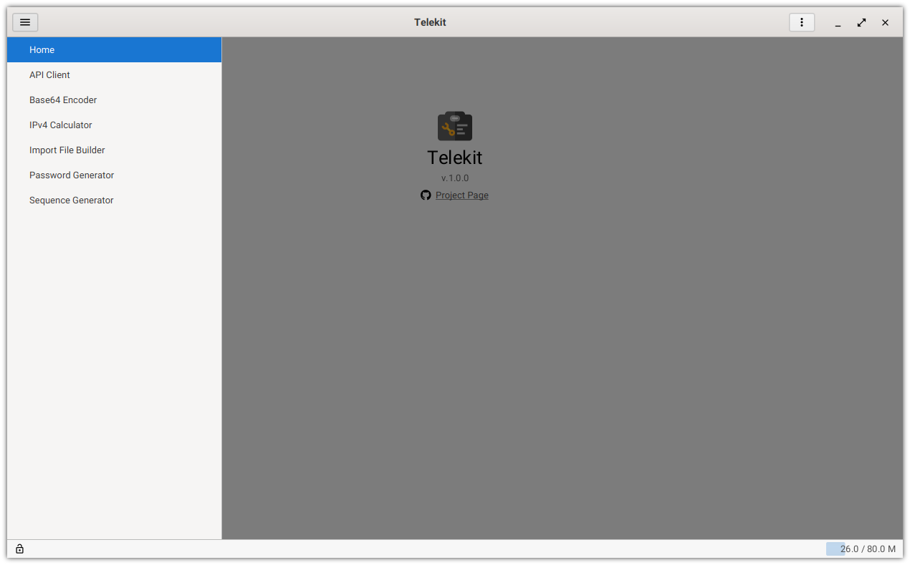

  <a href="https://github.com/mkpaz/telekit#features">Features</a> &#65372;
  <a href="https://github.com/mkpaz/telekit/releases">Download</a> &#65372;
  <a href="https://github.com/mkpaz/telekit/tree/master/.screenshots">Screenshots</a> &#65372;
  <a href="https://github.com/mkpaz/telekit#setup">Setup</a> &#65372;
  <a href="https://github.com/mkpaz/telekit/tree/master/BUILD.md">Build</a>

# Telekit

A set of tools for telecom engineers.

## Features

Base app provides the following tools:

- API Client

  API requests automation tool. It's not intended to provide complex API testing (like Postman or similar apps), but rather to perform bulk requests to
  automate routine _configurations tasks_.

- Base64 Encoder

  Base64 batch encoder and decoder. Supports standard, URL safe and MIME algorithms. Can convert provided data line by line or as a whole.

- Import File Builder

  Generates text files (like CSV, XML, configs, custom scripts etc) by predefined template.

- IPv4 Calculator

  Simple IPv4 calc. Supports subnet splitting and IP format conversion.

- Password Generator

  Batch password generator that supports three different types of passwords: random, katakana (consonant + vowel pairs) or [xkcd](https://imgs.xkcd.com/comics/password_strength.png).

- Sequence Generator

  Generates complex numeric sequences by predefined template.

### Plugins

App features can be extended via plugins. You can find extra plugins [here](https://github.com/mkpaz/telekit-plugins).

If you want to write your own plugin, clone this repo and use `telekit-plugin-example` as the starting point.

## Setup

Telekit is a Java app that uses [jlink](https://docs.oracle.com/javase/9/tools/jlink.htm) to build *native* runtime
image, so there is *no need to install Java*.

It's portable and packaged for Windows (both x32 and x64) and Linux-based systems.

## Credits

Application icons made by Freepik from [www.flaticon.com](https://flaticon.com).
